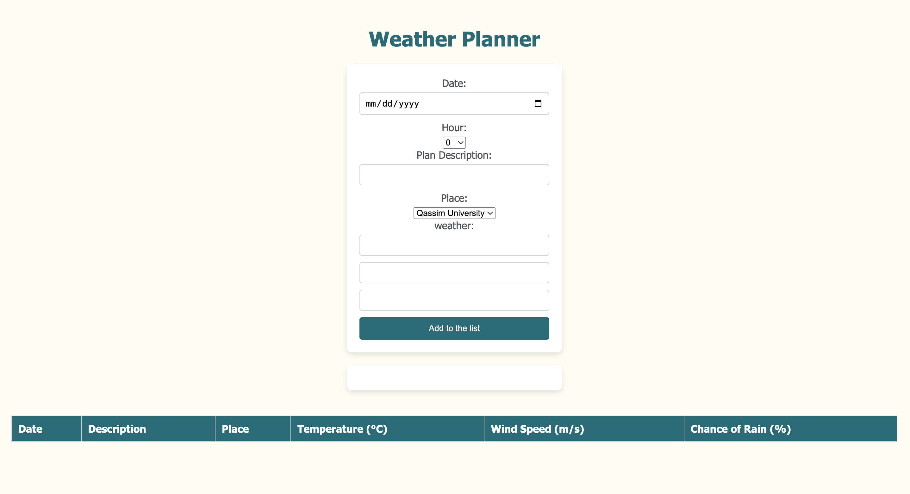
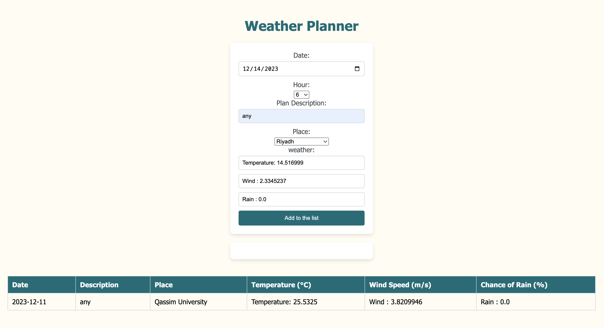

# Project-7-Weather-Planner

A personal planner that uses an API to incorporate weather information. 

## what to do:
the user enters date , hour, place(only 3 places provided) and plan 
then the weather info will be fetched

Here a screenshot of what the web application look
like.

## How to run:
* the docker compose should be installed and the credentials.ini file should be provided in wplanner folder. 
*  docker desktop should be running in the background
1. cd project-7-weatherplannaer-afnanjk2017
2. cd wplanner 
3. sudo docker-compose up -d
4. the port is localhost:5000
  

